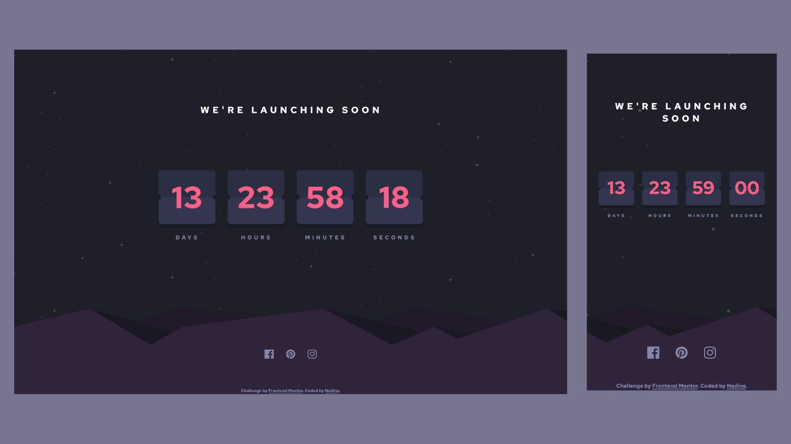

# Frontend Mentor - Launch countdown timer solution using ReactJS

This is a solution to the [Launch countdown timer challenge on Frontend Mentor](https://www.frontendmentor.io/challenges/launch-countdown-timer-N0XkGfyz-). Frontend Mentor challenges help you improve your coding skills by building realistic projects.

## Table of contents

- [Overview](#overview)
  - [The challenge](#the-challenge)
  - [Screenshot](#screenshot)
  - [Links](#links)
- [Built with](#built-with)
- [Author](#author)

## Overview

### The challenge

Users should be able to:

- See hover states for all interactive elements on the page
- See a live countdown timer that ticks down every second (start the count at 14 days)
- **Bonus**: When a number changes, make the card flip from the middle

### Screenshot

### Links

- Solution URL: [https://github.com/nadlgit/fmchallenge-launch-countdown](https://github.com/nadlgit/fmchallenge-launch-countdown)
- Live Site URL: [https://nadlgit.github.io/fmchallenge-launch-countdown](https://nadlgit.github.io/fmchallenge-launch-countdown)

## Built with

- [React](https://reactjs.org/) and [Typescript](https://www.typescriptlang.org/), through [Vite](https://vitejs.dev/) tool
- [CSS modules](https://github.com/css-modules/css-modules)
- CSS grid and flexbox
- CSS custom properties
- Responsive

## Author

- Frontend Mentor - [@nadlgit](https://www.frontendmentor.io/profile/nadlgit)
